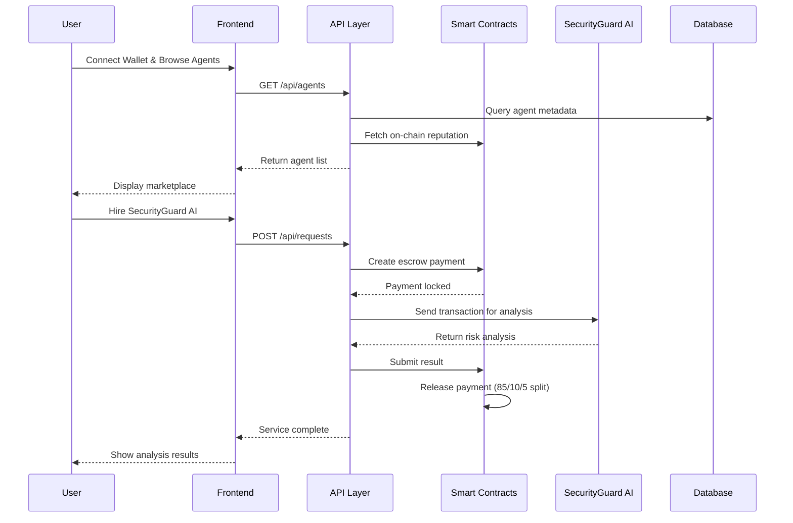

# AgentMarket - Master Technical Design

## Project Overview

**Project:** AgentMarket - Decentralized AI Agent Marketplace  
**Architecture:** Multi-layer Web3 application with AI integration  
**Development:** Kiro IDE with AWS Q Developer assistance  
**Deployment:** AWS Amplify + Solana blockchain  

## System Architecture

### High-Level Architecture

```
┌─────────────────────────────────────────────────────────┐
│                    USER INTERFACE                        │
│  Next.js 14 + TypeScript + TailwindCSS + Wallet Adapters│
└────────────────────┬────────────────────────────────────┘
                     │ HTTP/WebSocket
┌────────────────────▼────────────────────────────────────┐
│              APPLICATION LAYER                           │
│  • Agent Discovery & Search                             │
│  • Service Request Management                           │
│  • Payment Processing                                   │
│  • Creator Dashboard                                    │
│  • Security Analysis Interface                          │
└────────────────────┬────────────────────────────────────┘
                     │ RPC/API Calls
┌────────────────────▼────────────────────────────────────┐
│              SMART CONTRACT LAYER (Solana)              │
│  • Agent Registry Contract                              │
│  • Escrow Payment Contract                              │
│  • Reputation System Contract                           │
│  • Royalty Distribution Contract                        │
└────────────────────┬────────────────────────────────────┘
                     │ Webhook/API
┌────────────────────▼────────────────────────────────────┐
│              AI AGENT LAYER                             │
│  • SecurityGuard AI (Transaction Scanner)               │
│  • Agent Orchestrator                                   │
│  • Natural Language Processor                           │
│  • Result Validator                                     │
└─────────────────────────────────────────────────────────┘
```

### Component Interaction Flow



## Technology Stack

### Frontend Layer
- **Framework**: Next.js 14 (App Router) with TypeScript 5+
- **Styling**: TailwindCSS 3.4+ with shadcn/ui components
- **State Management**: React Query (TanStack Query) + Zustand
- **Web3 Integration**:
  - @solana/wallet-adapter-react v0.15+
  - @solana/wallet-adapter-wallets (Phantom, Solflare, Backpack)
  - @solana/web3.js v1.87+
- **Charts**: Recharts for analytics dashboards
- **Forms**: React Hook Form + Zod validation
- **Real-time**: Socket.io client for live updates

### Backend Services
- **API Framework**: Next.js API Routes (serverless) + FastAPI (Python AI services)
- **Database**: PostgreSQL 15 (AWS RDS) with connection pooling
- **Caching**: Redis (AWS ElastiCache) for performance optimization
- **Storage**:
  - IPFS for agent code/models (decentralized)
  - AWS S3 for media assets and backups
- **Message Queue**: AWS SQS for async processing

### Smart Contract Layer
- **Framework**: Anchor 0.30+ (Solana development framework)
- **Language**: Rust 1.75+ with Solana SDK
- **Programs**:
  - `agent_registry`: Agent registration and metadata storage
  - `marketplace_escrow`: Payment holding and release mechanism
  - `reputation_system`: On-chain ratings and reviews
  - `royalty_splitter`: Automated payment distribution
- **Token Standard**: Metaplex NFT for agent ownership representation
- **Network**: Solana mainnet with Helius RPC provider

### AI Agent Layer
- **Primary AI**: Claude Sonnet 4 (via Anthropic API)
- **Security Analysis**: Custom ML model trained on exploit patterns
- **NLP Interface**: Fine-tuned model for Web3 terminology
- **Orchestration**: LangChain for agent workflow management
- **Vector Database**: Pinecone for semantic search of agents
- **Model Training**: PyTorch with custom security datasets

## Core Components Design

### 1. Agent Registry Smart Contract

```rust
#[account]
pub struct AgentProfile {
    pub agent_id: Pubkey,           // Unique agent identifier
    pub creator: Pubkey,            // Creator wallet address
    pub name: String,               // Agent name (max 50 chars)
    pub description: String,        // Description (max 500 chars)
    pub capabilities: Vec<u8>,      // Capability flags (bitfield)
    pub pricing_model: PricingModel,
    pub endpoint_url: String,       // API endpoint for agent execution
    pub ipfs_hash: String,          // Agent code/model on IPFS
    pub reputation_score: u32,      // Average rating * 100
    pub total_services: u64,        // Total completed services
    pub total_earnings: u64,        // Total earnings in lamports
    pub created_at: i64,            // Unix timestamp
    pub is_active: bool,            // Can receive requests
    pub nft_mint: Pubkey,           // Agent ownership NFT
}

#[derive(AnchorSerialize, AnchorDeserialize, Clone)]
pub enum PricingModel {
    PerQuery { price: u64 },        // Fixed price per request
    Subscription { monthly: u64 },   // Monthly subscription
    Custom { base: u64, variable: u8 }, // Base + % of value
}
```

### 2. Marketplace Escrow System

```rust
#[account]
pub struct ServiceRequest {
    pub request_id: Pubkey,
    pub agent_id: Pubkey,
    pub user: Pubkey,
    pub amount: u64,                // Payment amount in lamports
    pub status: RequestStatus,
    pub request_data: String,       // User's request (IPFS hash)
    pub result_data: String,        // Agent's result (IPFS hash)
    pub created_at: i64,
    pub completed_at: Option<i64>,
    pub escrow_account: Pubkey,     // PDA holding funds
}

#[derive(AnchorSerialize, AnchorDeserialize, Clone, PartialEq)]
pub enum RequestStatus {
    Pending,        // Payment in escrow, awaiting agent
    InProgress,     // Agent working on request
    Completed,      // Result submitted, awaiting user approval
    Approved,       // User approved, payment released
    Disputed,       // User disputed, manual review needed
    Cancelled,      // Request cancelled, refund issued
}
```

### 3. SecurityGuard AI Architecture

```python
class SecurityGuardAI:
    def __init__(self):
        self.exploit_db = ExploitDatabase()
        self.ml_model = ThreatDetectionModel()
        self.nlp_processor = NaturalLanguageProcessor()
        
    async def analyze_transaction(self, transaction_data: dict) -> SecurityAnalysis:
        # Step 1: Parse transaction
        parsed_tx = self.parse_transaction(transaction_data)
        
        # Step 2: Check against known exploits
        pattern_matches = self.exploit_db.check_patterns(parsed_tx)
        
        # Step 3: ML-based anomaly detection
        anomaly_score = self.ml_model.predict(parsed_tx)
        
        # Step 4: Generate risk assessment
        risk_score = self.calculate_risk_score(pattern_matches, anomaly_score)
        
        # Step 5: Create human-readable explanation
        explanation = self.generate_explanation(risk_score, pattern_matches)
        
        return SecurityAnalysis(
            risk_score=risk_score,
            risk_level=self.get_risk_level(risk_score),
            explanation=explanation,
            recommendations=self.get_recommendations(risk_score)
        )
```

## Database Schema Design

### PostgreSQL Schema

```sql
-- Agent metadata cache
CREATE TABLE agents (
    id UUID PRIMARY KEY DEFAULT gen_random_uuid(),
    agent_id VARCHAR(44) UNIQUE NOT NULL, -- Solana pubkey
    creator_wallet VARCHAR(44) NOT NULL,
    name VARCHAR(100) NOT NULL,
    description TEXT,
    capabilities JSONB,
    pricing_model JSONB,
    endpoint_url TEXT,
    ipfs_hash VARCHAR(100),
    reputation_score DECIMAL(3,2) DEFAULT 0,
    total_services INTEGER DEFAULT 0,
    total_earnings BIGINT DEFAULT 0,
    is_active BOOLEAN DEFAULT true,
    created_at TIMESTAMP DEFAULT NOW(),
    updated_at TIMESTAMP DEFAULT NOW()
);

-- Service request history
CREATE TABLE service_requests (
    id UUID PRIMARY KEY DEFAULT gen_random_uuid(),
    request_id VARCHAR(44) UNIQUE NOT NULL,
    agent_id VARCHAR(44) REFERENCES agents(agent_id),
    user_wallet VARCHAR(44) NOT NULL,
    amount BIGINT NOT NULL,
    status VARCHAR(20) NOT NULL,
    request_data TEXT,
    result_data TEXT,
    created_at TIMESTAMP DEFAULT NOW(),
    completed_at TIMESTAMP
);

-- User profiles and preferences
CREATE TABLE user_profiles (
    wallet_address VARCHAR(44) PRIMARY KEY,
    username VARCHAR(50),
    email VARCHAR(255),
    preferences JSONB,
    created_at TIMESTAMP DEFAULT NOW(),
    last_active TIMESTAMP DEFAULT NOW()
);

-- Security scan history
CREATE TABLE security_scans (
    id UUID PRIMARY KEY DEFAULT gen_random_uuid(),
    user_wallet VARCHAR(44) NOT NULL,
    transaction_hash VARCHAR(88),
    risk_score INTEGER NOT NULL,
    risk_level VARCHAR(20) NOT NULL,
    explanation TEXT,
    scan_result JSONB,
    created_at TIMESTAMP DEFAULT NOW()
);
```

## API Design

### RESTful Endpoints

```typescript
// Agent Management
GET    /api/agents              // List agents with pagination/filtering
POST   /api/agents              // Register new agent
GET    /api/agents/:id          // Get agent details
PUT    /api/agents/:id          // Update agent (creator only)
DELETE /api/agents/:id          // Deactivate agent

// Service Requests
POST   /api/requests            // Create service request
GET    /api/requests/:id        // Get request status
PUT    /api/requests/:id/approve // Approve completed service
PUT    /api/requests/:id/dispute // Dispute service result

// Security Analysis
POST   /api/security/scan       // Analyze transaction
GET    /api/security/history    // User's scan history
POST   /api/security/chat       // Natural language security queries

// User Management
GET    /api/users/profile       // Get user profile
PUT    /api/users/profile       // Update user profile
GET    /api/users/dashboard     // Creator dashboard data
```

### WebSocket Events

```typescript
// Real-time updates
interface WebSocketEvents {
  'request:created': ServiceRequestCreated;
  'request:updated': ServiceRequestUpdated;
  'request:completed': ServiceRequestCompleted;
  'agent:registered': AgentRegistered;
  'payment:released': PaymentReleased;
  'security:alert': SecurityAlert;
}
```

This design document provides the comprehensive technical architecture for AgentMarket, demonstrating the integration of Web3 blockchain technology with AI capabilities as required by the hackathon criteria.