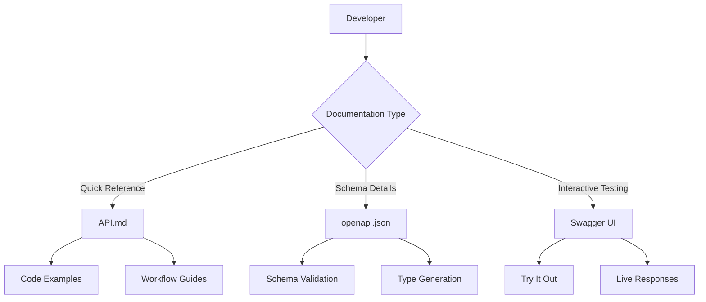

# API Documentation - Design Document

## Overview

This design implements comprehensive API documentation for AgentMarket using OpenAPI 3.0 specification, human-readable markdown documentation, and an interactive Swagger UI interface. The documentation covers all public API endpoints with complete schemas, examples, and multi-language code samples.

## Architecture

### Component Structure

```
docs/
├── API.md                          # Human-readable documentation
└── workflows/
    ├── agent-registration.md       # Complete workflow examples
    ├── service-request.md
    └── security-scanning.md

public/
└── api/
    └── openapi.json               # OpenAPI 3.0 specification

src/
└── app/
    └── api-docs/
        └── page.tsx               # Interactive Swagger UI page
```

### Documentation Flow



## OpenAPI Specification Design

### File Structure

```json
{
  "openapi": "3.0.0",
  "info": {
    "title": "AgentMarket API",
    "version": "1.0.0",
    "description": "API for the AgentMarket decentralized AI agent marketplace"
  },
  "servers": [
    {
      "url": "https://agentmarket.app/api",
      "description": "Production server"
    },
    {
      "url": "http://localhost:3000/api",
      "description": "Development server"
    }
  ],
  "paths": { ... },
  "components": {
    "schemas": { ... },
    "securitySchemes": { ... }
  }
}
```

### Schema Components

#### AgentProfile Schema
```json
{
  "AgentProfile": {
    "type": "object",
    "required": ["id", "name", "creator", "capabilities", "pricing"],
    "properties": {
      "id": {
        "type": "string",
        "description": "Solana public key of the agent",
        "example": "7xKXtg2CW87d97TXJSDpbD5jBkheTqA83TZRuJosgAsU"
      },
      "name": {
        "type": "string",
        "minLength": 1,
        "maxLength": 50,
        "description": "Agent display name"
      },
      "description": {
        "type": "string",
        "maxLength": 500,
        "description": "Agent description"
      },
      "creator": {
        "type": "string",
        "description": "Creator wallet address"
      },
      "capabilities": {
        "type": "array",
        "items": {
          "type": "string",
          "enum": ["security", "code-generation", "data-analysis", "nft-creation"]
        }
      },
      "pricing": {
        "$ref": "#/components/schemas/PricingModel"
      },
      "reputation": {
        "type": "number",
        "minimum": 0,
        "maximum": 5,
        "description": "Average rating"
      },
      "totalServices": {
        "type": "integer",
        "description": "Total completed services"
      },
      "isActive": {
        "type": "boolean"
      }
    }
  }
}
```

#### PricingModel Schema
```json
{
  "PricingModel": {
    "type": "object",
    "required": ["model", "amount"],
    "properties": {
      "model": {
        "type": "string",
        "enum": ["per-query", "subscription", "custom"]
      },
      "amount": {
        "type": "number",
        "description": "Price in SOL",
        "minimum": 0,
        "maximum": 1000
      },
      "interval": {
        "type": "string",
        "enum": ["monthly", "yearly"],
        "description": "Required for subscription model"
      }
    }
  }
}
```

#### ServiceRequest Schema
```json
{
  "ServiceRequest": {
    "type": "object",
    "required": ["id", "agentId", "user", "amount", "status"],
    "properties": {
      "id": {
        "type": "string",
        "description": "Request public key"
      },
      "agentId": {
        "type": "string",
        "description": "Agent public key"
      },
      "user": {
        "type": "string",
        "description": "User wallet address"
      },
      "amount": {
        "type": "number",
        "description": "Payment amount in SOL"
      },
      "status": {
        "type": "string",
        "enum": ["pending", "in-progress", "completed", "approved", "disputed", "cancelled"]
      },
      "requestData": {
        "type": "string",
        "description": "Request payload"
      },
      "resultData": {
        "type": "string",
        "description": "Agent result"
      },
      "createdAt": {
        "type": "string",
        "format": "date-time"
      },
      "completedAt": {
        "type": "string",
        "format": "date-time"
      }
    }
  }
}
```

#### ScanResult Schema
```json
{
  "ScanResult": {
    "type": "object",
    "required": ["riskLevel", "riskScore", "explanation"],
    "properties": {
      "riskLevel": {
        "type": "string",
        "enum": ["SAFE", "CAUTION", "DANGER"]
      },
      "riskScore": {
        "type": "integer",
        "minimum": 0,
        "maximum": 100
      },
      "explanation": {
        "type": "string",
        "description": "Human-readable risk explanation"
      },
      "details": {
        "type": "object",
        "properties": {
          "programChecks": {
            "type": "array",
            "items": {
              "type": "object",
              "properties": {
                "programId": { "type": "string" },
                "status": { "type": "string", "enum": ["verified", "unknown", "malicious"] },
                "reason": { "type": "string" }
              }
            }
          },
          "patternMatches": {
            "type": "array",
            "items": { "type": "string" }
          },
          "accountFlags": {
            "type": "array",
            "items": { "type": "string" }
          }
        }
      },
      "scanId": {
        "type": "string",
        "format": "uuid"
      },
      "scannedAt": {
        "type": "string",
        "format": "date-time"
      }
    }
  }
}
```

#### Error Schema
```json
{
  "Error": {
    "type": "object",
    "required": ["error"],
    "properties": {
      "error": {
        "type": "string",
        "description": "Error message"
      },
      "details": {
        "type": "object",
        "description": "Additional error details"
      },
      "code": {
        "type": "string",
        "description": "Error code"
      }
    }
  }
}
```

### API Endpoints

#### Agent Endpoints

**POST /api/agents/register**
```json
{
  "summary": "Register a new AI agent",
  "requestBody": {
    "required": true,
    "content": {
      "application/json": {
        "schema": {
          "type": "object",
          "required": ["name", "description", "capabilities", "pricing", "endpointUrl"],
          "properties": {
            "name": { "type": "string", "minLength": 1, "maxLength": 50 },
            "description": { "type": "string", "maxLength": 500 },
            "capabilities": {
              "type": "array",
              "items": { "type": "string" }
            },
            "pricing": { "$ref": "#/components/schemas/PricingModel" },
            "endpointUrl": { "type": "string", "format": "uri" },
            "ipfsHash": { "type": "string" }
          }
        }
      }
    }
  },
  "responses": {
    "201": {
      "description": "Agent registered successfully",
      "content": {
        "application/json": {
          "schema": {
            "type": "object",
            "properties": {
              "agent": { "$ref": "#/components/schemas/AgentProfile" },
              "transactionSignature": { "type": "string" }
            }
          }
        }
      }
    },
    "400": {
      "description": "Validation error",
      "content": {
        "application/json": {
          "schema": { "$ref": "#/components/schemas/Error" }
        }
      }
    }
  }
}
```

**GET /api/agents/{id}**
```json
{
  "summary": "Get agent details by ID",
  "parameters": [
    {
      "name": "id",
      "in": "path",
      "required": true,
      "schema": { "type": "string" },
      "description": "Agent public key"
    }
  ],
  "responses": {
    "200": {
      "description": "Agent details",
      "content": {
        "application/json": {
          "schema": {
            "type": "object",
            "properties": {
              "agent": { "$ref": "#/components/schemas/AgentProfile" }
            }
          }
        }
      }
    },
    "404": {
      "description": "Agent not found",
      "content": {
        "application/json": {
          "schema": { "$ref": "#/components/schemas/Error" }
        }
      }
    }
  }
}
```

**GET /api/agents/search**
```json
{
  "summary": "Search for agents",
  "parameters": [
    {
      "name": "query",
      "in": "query",
      "schema": { "type": "string" },
      "description": "Search query"
    },
    {
      "name": "capability",
      "in": "query",
      "schema": { "type": "string" },
      "description": "Filter by capability"
    },
    {
      "name": "minRating",
      "in": "query",
      "schema": { "type": "number", "minimum": 0, "maximum": 5 },
      "description": "Minimum rating filter"
    },
    {
      "name": "maxPrice",
      "in": "query",
      "schema": { "type": "number" },
      "description": "Maximum price in SOL"
    },
    {
      "name": "page",
      "in": "query",
      "schema": { "type": "integer", "default": 1 },
      "description": "Page number"
    },
    {
      "name": "limit",
      "in": "query",
      "schema": { "type": "integer", "default": 20, "maximum": 100 },
      "description": "Results per page"
    }
  ],
  "responses": {
    "200": {
      "description": "Search results",
      "content": {
        "application/json": {
          "schema": {
            "type": "object",
            "properties": {
              "agents": {
                "type": "array",
                "items": { "$ref": "#/components/schemas/AgentProfile" }
              },
              "total": { "type": "integer" },
              "page": { "type": "integer" },
              "totalPages": { "type": "integer" }
            }
          }
        }
      }
    }
  }
}
```

#### Security Endpoints

**POST /api/security/scan**
```json
{
  "summary": "Scan a transaction for security risks",
  "requestBody": {
    "required": true,
    "content": {
      "application/json": {
        "schema": {
          "type": "object",
          "required": ["transaction"],
          "properties": {
            "transaction": {
              "type": "string",
              "description": "Base64 encoded transaction"
            },
            "userWallet": {
              "type": "string",
              "description": "User wallet address"
            }
          }
        }
      }
    }
  },
  "responses": {
    "200": {
      "description": "Scan completed",
      "content": {
        "application/json": {
          "schema": { "$ref": "#/components/schemas/ScanResult" }
        }
      }
    },
    "400": {
      "description": "Invalid transaction data",
      "content": {
        "application/json": {
          "schema": { "$ref": "#/components/schemas/Error" }
        }
      }
    },
    "429": {
      "description": "Rate limit exceeded",
      "content": {
        "application/json": {
          "schema": { "$ref": "#/components/schemas/Error" }
        }
      }
    }
  }
}
```

#### Service Request Endpoints

**POST /api/requests/create**
```json
{
  "summary": "Create a service request",
  "requestBody": {
    "required": true,
    "content": {
      "application/json": {
        "schema": {
          "type": "object",
          "required": ["agentId", "requestData"],
          "properties": {
            "agentId": { "type": "string" },
            "requestData": { "type": "string" }
          }
        }
      }
    }
  },
  "responses": {
    "201": {
      "description": "Request created",
      "content": {
        "application/json": {
          "schema": {
            "type": "object",
            "properties": {
              "request": { "$ref": "#/components/schemas/ServiceRequest" },
              "transactionSignature": { "type": "string" }
            }
          }
        }
      }
    }
  }
}
```

**GET /api/requests/{id}**
```json
{
  "summary": "Get request status",
  "parameters": [
    {
      "name": "id",
      "in": "path",
      "required": true,
      "schema": { "type": "string" }
    }
  ],
  "responses": {
    "200": {
      "description": "Request details",
      "content": {
        "application/json": {
          "schema": {
            "type": "object",
            "properties": {
              "request": { "$ref": "#/components/schemas/ServiceRequest" }
            }
          }
        }
      }
    }
  }
}
```

**POST /api/requests/{id}/approve**
```json
{
  "summary": "Approve service result and release payment",
  "parameters": [
    {
      "name": "id",
      "in": "path",
      "required": true,
      "schema": { "type": "string" }
    }
  ],
  "requestBody": {
    "required": true,
    "content": {
      "application/json": {
        "schema": {
          "type": "object",
          "required": ["rating"],
          "properties": {
            "rating": {
              "type": "object",
              "properties": {
                "stars": { "type": "integer", "minimum": 1, "maximum": 5 },
                "quality": { "type": "integer", "minimum": 1, "maximum": 5 },
                "speed": { "type": "integer", "minimum": 1, "maximum": 5 },
                "value": { "type": "integer", "minimum": 1, "maximum": 5 },
                "reviewText": { "type": "string", "maxLength": 500 }
              }
            }
          }
        }
      }
    }
  },
  "responses": {
    "200": {
      "description": "Request approved",
      "content": {
        "application/json": {
          "schema": {
            "type": "object",
            "properties": {
              "request": { "$ref": "#/components/schemas/ServiceRequest" },
              "transactionSignature": { "type": "string" }
            }
          }
        }
      }
    }
  }
}
```

## Human-Readable Documentation Design

### Structure

```markdown
# AgentMarket API Documentation

## Table of Contents
1. Introduction
2. Authentication
3. Rate Limiting
4. Error Handling
5. Endpoints
   - Agent Management
   - Service Requests
   - Security Scanning
   - Dashboard & Analytics
6. Workflows
7. Code Examples
8. Changelog

## Quick Start

### Base URL
- Production: `https://agentmarket.app/api`
- Development: `http://localhost:3000/api`

### Authentication
Most endpoints require wallet signature authentication...

## Endpoints

### Agent Management

#### Register Agent
**POST** `/api/agents/register`

Register a new AI agent on the marketplace.

**Request Body:**
```json
{
  "name": "SecurityGuard AI",
  "description": "Transaction security scanner",
  "capabilities": ["security"],
  "pricing": {
    "model": "per-query",
    "amount": 0.01
  },
  "endpointUrl": "https://api.example.com/agent",
  "ipfsHash": "QmHash123"
}
```

**Response (201):**
```json
{
  "agent": {
    "id": "7xKXtg2CW87d97TXJSDpbD5jBkheTqA83TZRuJosgAsU",
    "name": "SecurityGuard AI",
    ...
  },
  "transactionSignature": "5j7s..."
}
```

**cURL Example:**
```bash
curl -X POST https://agentmarket.app/api/agents/register \
  -H "Content-Type: application/json" \
  -d '{
    "name": "SecurityGuard AI",
    "description": "Transaction security scanner",
    "capabilities": ["security"],
    "pricing": {"model": "per-query", "amount": 0.01},
    "endpointUrl": "https://api.example.com/agent"
  }'
```

**JavaScript Example:**
```javascript
const response = await fetch('https://agentmarket.app/api/agents/register', {
  method: 'POST',
  headers: { 'Content-Type': 'application/json' },
  body: JSON.stringify({
    name: 'SecurityGuard AI',
    description: 'Transaction security scanner',
    capabilities: ['security'],
    pricing: { model: 'per-query', amount: 0.01 },
    endpointUrl: 'https://api.example.com/agent'
  })
});
const data = await response.json();
```

**Python Example:**
```python
import requests

response = requests.post(
    'https://agentmarket.app/api/agents/register',
    json={
        'name': 'SecurityGuard AI',
        'description': 'Transaction security scanner',
        'capabilities': ['security'],
        'pricing': {'model': 'per-query', 'amount': 0.01},
        'endpointUrl': 'https://api.example.com/agent'
    }
)
data = response.json()
```
```

### Workflow Examples Structure

Each workflow will include:
1. Overview and use case
2. Step-by-step API calls
3. Request/response examples
4. Error handling
5. Complete code example

## Interactive Documentation Design

### Swagger UI Integration

```typescript
// src/app/api-docs/page.tsx
'use client';

import SwaggerUI from 'swagger-ui-react';
import 'swagger-ui-react/swagger-ui.css';

export default function ApiDocsPage() {
  return (
    <div className="container mx-auto py-8">
      <h1 className="text-3xl font-bold mb-6">AgentMarket API Documentation</h1>
      <SwaggerUI url="/api/openapi.json" />
    </div>
  );
}
```

### Features
- Try It Out functionality for all endpoints
- Request/response examples
- Schema validation
- Authentication configuration
- Response visualization

## Data Models

### Complete Type Definitions

```typescript
// lib/api/types.ts
export interface AgentProfile {
  id: string;
  name: string;
  description: string;
  creator: string;
  capabilities: string[];
  pricing: PricingModel;
  reputation: number;
  totalServices: number;
  totalEarnings: number;
  isActive: boolean;
  createdAt: string;
  nftMint: string;
}

export interface PricingModel {
  model: 'per-query' | 'subscription' | 'custom';
  amount: number;
  interval?: 'monthly' | 'yearly';
}

export interface ServiceRequest {
  id: string;
  agentId: string;
  user: string;
  amount: number;
  status: 'pending' | 'in-progress' | 'completed' | 'approved' | 'disputed' | 'cancelled';
  requestData: string;
  resultData?: string;
  createdAt: string;
  completedAt?: string;
}

export interface ScanResult {
  riskLevel: 'SAFE' | 'CAUTION' | 'DANGER';
  riskScore: number;
  explanation: string;
  details: {
    programChecks: Array<{
      programId: string;
      status: 'verified' | 'unknown' | 'malicious';
      reason: string;
    }>;
    patternMatches: string[];
    accountFlags: string[];
  };
  scanId: string;
  scannedAt: string;
}

export interface Rating {
  id: string;
  agentId: string;
  user: string;
  requestId: string;
  stars: number;
  quality: number;
  speed: number;
  value: number;
  reviewText: string;
  createdAt: string;
}

export interface ApiError {
  error: string;
  details?: Record<string, any>;
  code?: string;
}
```

## Error Handling

### Standard Error Responses

All endpoints follow consistent error response format:

```json
{
  "error": "Human-readable error message",
  "details": {
    "field": "Specific field error"
  },
  "code": "ERROR_CODE"
}
```

### HTTP Status Codes

- 200: Success
- 201: Created
- 400: Bad Request (validation error)
- 401: Unauthorized
- 404: Not Found
- 429: Too Many Requests (rate limit)
- 500: Internal Server Error

### Error Code Reference

- `VALIDATION_ERROR`: Request validation failed
- `AGENT_NOT_FOUND`: Agent does not exist
- `REQUEST_NOT_FOUND`: Service request does not exist
- `UNAUTHORIZED`: Authentication required or failed
- `RATE_LIMIT_EXCEEDED`: Too many requests
- `INVALID_TRANSACTION`: Transaction data is malformed
- `INSUFFICIENT_FUNDS`: Not enough SOL for operation

## Rate Limiting

### Limits by Endpoint Category

- Agent Search: 60 requests/minute
- Agent Registration: 10 requests/hour
- Security Scanning: 10 requests/minute
- Service Requests: 30 requests/minute
- Dashboard: 60 requests/minute

### Rate Limit Headers

```
X-RateLimit-Limit: 60
X-RateLimit-Remaining: 45
X-RateLimit-Reset: 1699564800
```

## Testing Strategy

### Documentation Validation

1. OpenAPI spec validation using Swagger Editor
2. Example request/response validation
3. Schema consistency checks
4. Link validation in markdown docs

### Integration Testing

1. Test all documented endpoints exist
2. Verify request/response schemas match spec
3. Validate error responses
4. Test rate limiting behavior

## Implementation Notes

### File Locations

- OpenAPI spec: `public/api/openapi.json`
- Human-readable docs: `docs/API.md`
- Workflow examples: `docs/workflows/*.md`
- Swagger UI page: `src/app/api-docs/page.tsx`
- Type definitions: `src/lib/api/types.ts`

### Dependencies

```json
{
  "swagger-ui-react": "^5.10.0",
  "@types/swagger-ui-react": "^4.18.3"
}
```

### Maintenance

- Update OpenAPI spec when endpoints change
- Keep examples in sync with actual API behavior
- Update changelog for all API changes
- Regenerate type definitions from OpenAPI spec
