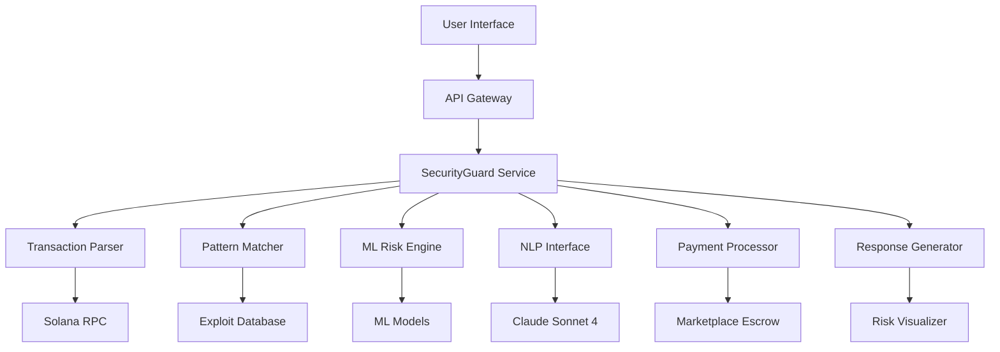
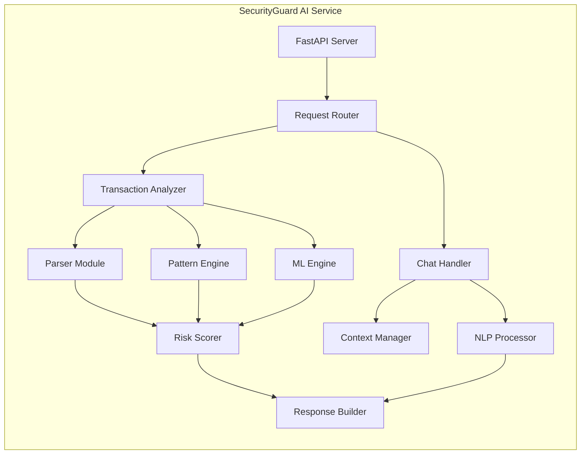

# SecurityGuard AI - Technical Design Specification

## Overview

SecurityGuard AI is a sophisticated transaction security analysis system that combines machine learning, pattern matching, and natural language processing to protect Solana users from malicious transactions. The system operates as a microservice within the AgentMarket ecosystem, providing real-time threat detection through both API endpoints and conversational interfaces.

## Architecture

### High-Level System Architecture



### Service Architecture



## Components and Interfaces

### 1. Transaction Parser Module

**Purpose:** Deserialize and extract meaningful data from Solana transactions

**Input Interface:**
```typescript
interface TransactionInput {
  serialized_transaction: string;  // Base64 encoded
  user_wallet?: string;           // Optional for context
  network?: 'mainnet' | 'devnet'; // Default: mainnet
}
```

**Core Functions:**
- `parse_transaction()`: Deserialize transaction bytes
- `extract_programs()`: Identify all program IDs involved
- `decode_instructions()`: Parse instruction data and accounts
- `analyze_accounts()`: Examine account relationships and permissions

**Output Interface:**
```typescript
interface ParsedTransaction {
  programs: ProgramInfo[];
  instructions: InstructionInfo[];
  accounts: AccountInfo[];
  signatures_required: number;
  recent_blockhash: string;
}
```

### 2. Pattern Matching Engine

**Purpose:** Compare transactions against known exploit signatures

**Database Schema:**
```sql
CREATE TABLE exploit_patterns (
    id SERIAL PRIMARY KEY,
    pattern_type VARCHAR(50) NOT NULL,
    program_id VARCHAR(44),
    instruction_signature BYTEA,
    description TEXT,
    severity INTEGER CHECK (severity BETWEEN 1 AND 10),
    created_at TIMESTAMP DEFAULT NOW(),
    updated_at TIMESTAMP DEFAULT NOW()
);

CREATE INDEX idx_program_id ON exploit_patterns(program_id);
CREATE INDEX idx_pattern_type ON exploit_patterns(pattern_type);
```

**Matching Algorithms:**
1. **Exact Match**: Direct program ID and instruction comparison
2. **Fuzzy Match**: Levenshtein distance for similar patterns
3. **Behavioral Match**: Multi-instruction sequence detection
4. **Account Pattern Match**: Suspicious account interaction patterns

**Performance Targets:**
- Pattern lookup: <100ms
- Database size: 10M+ patterns
- Update frequency: Daily
- Memory usage: <2GB for hot patterns

### 3. Machine Learning Risk Engine

**Model Architecture:**
```python
class TransactionRiskModel:
    def __init__(self):
        self.feature_extractor = FeatureExtractor()
        self.anomaly_detector = IsolationForest()
        self.classifier = XGBoostClassifier()
        self.ensemble = VotingClassifier([
            ('isolation', self.anomaly_detector),
            ('xgboost', self.classifier)
        ])
```

**Feature Engineering:**
```python
def extract_features(transaction: ParsedTransaction) -> np.ndarray:
    features = []
    
    # Program-based features
    features.extend([
        len(transaction.programs),
        count_unknown_programs(transaction.programs),
        count_recently_deployed(transaction.programs)
    ])
    
    # Account-based features
    features.extend([
        len(transaction.accounts),
        count_new_accounts(transaction.accounts),
        calculate_account_centrality(transaction.accounts)
    ])
    
    # Instruction-based features
    features.extend([
        len(transaction.instructions),
        count_token_transfers(transaction.instructions),
        count_authority_changes(transaction.instructions)
    ])
    
    # Value flow features
    features.extend([
        calculate_total_value(transaction),
        calculate_value_concentration(transaction),
        detect_circular_transfers(transaction)
    ])
    
    return np.array(features)
```

**Training Pipeline:**
1. **Data Collection**: 100K+ labeled transactions (exploits + normal)
2. **Feature Engineering**: Extract 50+ numerical features
3. **Model Training**: XGBoost with cross-validation
4. **Validation**: Hold-out test set with temporal split
5. **Deployment**: Model versioning with A/B testing

### 4. Natural Language Processing Interface

**Architecture:**
```python
class NLPInterface:
    def __init__(self):
        self.intent_classifier = IntentClassifier()
        self.entity_extractor = EntityExtractor()
        self.context_manager = ConversationContext()
        self.response_generator = ClaudeInterface()
```

**Intent Classification:**
```python
SUPPORTED_INTENTS = {
    'transaction_scan': 'User wants to analyze a specific transaction',
    'general_security': 'User asks about Web3 security best practices',
    'threat_explanation': 'User wants explanation of a specific threat',
    'platform_help': 'User needs help using SecurityGuard',
    'educational': 'User wants to learn about blockchain security'
}
```

**Entity Extraction:**
- Solana addresses (base58 format validation)
- Program IDs and account addresses
- Token names and symbols
- Transaction signatures
- Numerical values (SOL amounts, percentages)

**Claude Integration:**
```python
async def generate_response(
    query: str, 
    context: ConversationContext,
    analysis_result: Optional[RiskAnalysis] = None
) -> str:
    
    prompt = f"""
    You are SecurityGuard AI, a blockchain security expert. 
    
    User Query: {query}
    Context: {context.get_summary()}
    
    {f"Analysis Result: {analysis_result}" if analysis_result else ""}
    
    Provide a helpful, accurate response in plain English.
    Focus on actionable security advice.
    """
    
    response = await claude_client.complete(prompt)
    return response.text
```

### 5. Risk Scoring Algorithm

**Scoring Methodology:**
```python
def calculate_risk_score(
    pattern_matches: List[PatternMatch],
    ml_prediction: MLPrediction,
    account_flags: List[AccountFlag]
) -> RiskScore:
    
    base_score = 0
    
    # Pattern matching (0-70 points)
    for match in pattern_matches:
        if match.type == 'CRITICAL':
            base_score = 100  # Immediate danger
            break
        elif match.type == 'HIGH':
            base_score += 40
        elif match.type == 'MEDIUM':
            base_score += 20
        elif match.type == 'LOW':
            base_score += 10
    
    # ML prediction (0-30 points)
    ml_score = ml_prediction.anomaly_score * 30
    base_score += ml_score
    
    # Account flags (0-20 points)
    for flag in account_flags:
        base_score += flag.severity * 5
    
    # Cap at 100
    final_score = min(base_score, 100)
    
    return RiskScore(
        value=final_score,
        level=get_risk_level(final_score),
        confidence=calculate_confidence(pattern_matches, ml_prediction)
    )

def get_risk_level(score: int) -> str:
    if score >= 70:
        return "DANGER"
    elif score >= 30:
        return "CAUTION"
    else:
        return "SAFE"
```

### 6. Response Generation System

**Response Structure:**
```typescript
interface SecurityAnalysisResponse {
  risk_level: 'SAFE' | 'CAUTION' | 'DANGER';
  risk_score: number;
  confidence: number;
  explanation: string;
  recommendation: string;
  details: {
    pattern_matches: PatternMatch[];
    ml_analysis: MLAnalysis;
    account_flags: AccountFlag[];
    program_analysis: ProgramAnalysis[];
  };
  scan_metadata: {
    scan_id: string;
    timestamp: string;
    processing_time_ms: number;
    model_version: string;
  };
}
```

**Explanation Generation:**
```python
def generate_explanation(risk_analysis: RiskAnalysis) -> str:
    explanation_parts = []
    
    if risk_analysis.pattern_matches:
        explanation_parts.append(
            f"This transaction matches {len(risk_analysis.pattern_matches)} "
            f"known exploit patterns."
        )
    
    if risk_analysis.ml_analysis.anomaly_score > 0.7:
        explanation_parts.append(
            "Our AI detected unusual patterns that suggest potential threats."
        )
    
    if risk_analysis.account_flags:
        explanation_parts.append(
            f"We found {len(risk_analysis.account_flags)} suspicious account behaviors."
        )
    
    return " ".join(explanation_parts)
```

## Data Models

### Core Data Structures

```python
@dataclass
class TransactionAnalysis:
    transaction_id: str
    user_wallet: Optional[str]
    parsed_transaction: ParsedTransaction
    pattern_matches: List[PatternMatch]
    ml_prediction: MLPrediction
    account_flags: List[AccountFlag]
    risk_score: RiskScore
    processing_time_ms: int
    timestamp: datetime

@dataclass
class PatternMatch:
    pattern_id: str
    pattern_type: str
    severity: int
    description: str
    evidence: Dict[str, Any]
    confidence: float

@dataclass
class MLPrediction:
    anomaly_score: float
    classification: str
    confidence: float
    feature_importance: Dict[str, float]
    model_version: str

@dataclass
class AccountFlag:
    account_address: str
    flag_type: str
    severity: int
    description: str
    evidence: Dict[str, Any]
```

### Database Schema

```sql
-- Scan history for authenticated users
CREATE TABLE scan_history (
    id UUID PRIMARY KEY DEFAULT gen_random_uuid(),
    user_wallet VARCHAR(44) NOT NULL,
    transaction_hash VARCHAR(88),
    risk_score INTEGER NOT NULL,
    risk_level VARCHAR(10) NOT NULL,
    scan_result JSONB NOT NULL,
    created_at TIMESTAMP DEFAULT NOW()
);

-- Pattern match cache for performance
CREATE TABLE pattern_cache (
    transaction_signature VARCHAR(88) PRIMARY KEY,
    matches JSONB NOT NULL,
    expires_at TIMESTAMP NOT NULL
);

-- ML model performance tracking
CREATE TABLE model_performance (
    id SERIAL PRIMARY KEY,
    model_version VARCHAR(50) NOT NULL,
    accuracy DECIMAL(5,4),
    precision_score DECIMAL(5,4),
    recall SCORE DECIMAL(5,4),
    f1_score DECIMAL(5,4),
    evaluated_at TIMESTAMP DEFAULT NOW()
);
```

## Error Handling

### Error Categories and Responses

```python
class SecurityGuardError(Exception):
    """Base exception for SecurityGuard errors"""
    pass

class TransactionParsingError(SecurityGuardError):
    """Failed to parse transaction data"""
    def __init__(self, message: str, transaction_data: str):
        self.message = message
        self.transaction_data = transaction_data
        super().__init__(message)

class PatternMatchingError(SecurityGuardError):
    """Error in pattern matching process"""
    pass

class MLModelError(SecurityGuardError):
    """Machine learning model prediction failed"""
    pass

class PaymentError(SecurityGuardError):
    """Payment processing failed"""
    pass

# Error handling middleware
@app.exception_handler(SecurityGuardError)
async def security_guard_exception_handler(request: Request, exc: SecurityGuardError):
    return JSONResponse(
        status_code=400,
        content={
            "error": exc.__class__.__name__,
            "message": str(exc),
            "scan_id": generate_scan_id(),
            "timestamp": datetime.utcnow().isoformat()
        }
    )
```

### Graceful Degradation

```python
async def analyze_transaction_with_fallback(
    transaction_data: str
) -> SecurityAnalysisResponse:
    
    try:
        # Full analysis pipeline
        return await full_analysis(transaction_data)
    
    except MLModelError:
        # Fallback to pattern matching only
        logger.warning("ML model failed, using pattern matching only")
        return await pattern_only_analysis(transaction_data)
    
    except PatternMatchingError:
        # Fallback to basic validation
        logger.warning("Pattern matching failed, using basic validation")
        return await basic_validation(transaction_data)
    
    except Exception as e:
        # Last resort: return safe response with error
        logger.error(f"All analysis methods failed: {e}")
        return SecurityAnalysisResponse(
            risk_level="CAUTION",
            risk_score=50,
            explanation="Unable to complete full analysis. Please verify transaction manually.",
            recommendation="Exercise caution and verify transaction details before signing."
        )
```

## Testing Strategy

### Unit Testing

```python
class TestTransactionParser:
    def test_parse_valid_transaction(self):
        # Test with known good transaction
        pass
    
    def test_parse_malicious_transaction(self):
        # Test with known exploit transaction
        pass
    
    def test_parse_invalid_data(self):
        # Test error handling for malformed data
        pass

class TestPatternMatcher:
    def test_exact_pattern_match(self):
        # Test detection of known exploit signatures
        pass
    
    def test_fuzzy_pattern_match(self):
        # Test detection of similar patterns
        pass
    
    def test_no_false_positives(self):
        # Test with legitimate transactions
        pass

class TestMLModel:
    def test_model_prediction_accuracy(self):
        # Test on validation dataset
        pass
    
    def test_model_performance_benchmarks(self):
        # Test response time and resource usage
        pass
```

### Integration Testing

```python
class TestSecurityGuardAPI:
    async def test_full_scan_workflow(self):
        # Test complete scan from request to response
        pass
    
    async def test_payment_integration(self):
        # Test payment processing with marketplace
        pass
    
    async def test_chat_interface(self):
        # Test natural language queries
        pass
    
    async def test_concurrent_requests(self):
        # Test system under load
        pass
```

### Performance Testing

```python
class TestPerformance:
    async def test_scan_response_time(self):
        # Verify <2 second response time
        assert response_time < 2.0
    
    async def test_concurrent_load(self):
        # Test 100 concurrent requests
        pass
    
    async def test_database_performance(self):
        # Test pattern lookup speed
        assert lookup_time < 0.1
```

## Performance Optimization

### Caching Strategy

```python
# Redis cache configuration
CACHE_CONFIG = {
    'pattern_cache_ttl': 3600,  # 1 hour
    'ml_prediction_cache_ttl': 300,  # 5 minutes
    'account_analysis_cache_ttl': 1800,  # 30 minutes
}

# Cache implementation
class CacheManager:
    def __init__(self, redis_client):
        self.redis = redis_client
    
    async def get_pattern_matches(self, transaction_hash: str) -> Optional[List[PatternMatch]]:
        cached = await self.redis.get(f"patterns:{transaction_hash}")
        if cached:
            return json.loads(cached)
        return None
    
    async def cache_pattern_matches(self, transaction_hash: str, matches: List[PatternMatch]):
        await self.redis.setex(
            f"patterns:{transaction_hash}",
            CACHE_CONFIG['pattern_cache_ttl'],
            json.dumps([match.dict() for match in matches])
        )
```

### Database Optimization

```sql
-- Optimized indexes for pattern matching
CREATE INDEX CONCURRENTLY idx_exploit_patterns_composite 
ON exploit_patterns(pattern_type, severity DESC, program_id);

-- Partitioning for scan history
CREATE TABLE scan_history_2024 PARTITION OF scan_history
FOR VALUES FROM ('2024-01-01') TO ('2025-01-01');

-- Materialized view for analytics
CREATE MATERIALIZED VIEW daily_threat_stats AS
SELECT 
    DATE(created_at) as scan_date,
    risk_level,
    COUNT(*) as scan_count,
    AVG(risk_score) as avg_risk_score
FROM scan_history
GROUP BY DATE(created_at), risk_level;
```

### Async Processing

```python
# Async pipeline for better performance
async def analyze_transaction_async(transaction_data: str) -> SecurityAnalysisResponse:
    # Parse transaction
    parsed_tx = await parse_transaction_async(transaction_data)
    
    # Run analysis components in parallel
    pattern_task = asyncio.create_task(match_patterns_async(parsed_tx))
    ml_task = asyncio.create_task(ml_predict_async(parsed_tx))
    account_task = asyncio.create_task(analyze_accounts_async(parsed_tx))
    
    # Wait for all components
    pattern_matches, ml_prediction, account_flags = await asyncio.gather(
        pattern_task, ml_task, account_task
    )
    
    # Calculate final risk score
    risk_score = calculate_risk_score(pattern_matches, ml_prediction, account_flags)
    
    return build_response(risk_score, pattern_matches, ml_prediction, account_flags)
```

## Security Considerations

### Input Validation

```python
def validate_transaction_input(data: dict) -> TransactionInput:
    # Validate base64 encoding
    try:
        base64.b64decode(data['serialized_transaction'])
    except Exception:
        raise ValidationError("Invalid base64 transaction data")
    
    # Validate wallet address format
    if 'user_wallet' in data:
        if not is_valid_solana_address(data['user_wallet']):
            raise ValidationError("Invalid Solana wallet address")
    
    # Validate network parameter
    if 'network' in data and data['network'] not in ['mainnet', 'devnet']:
        raise ValidationError("Invalid network parameter")
    
    return TransactionInput(**data)
```

### Rate Limiting

```python
from slowapi import Limiter, _rate_limit_exceeded_handler
from slowapi.util import get_remote_address

limiter = Limiter(key_func=get_remote_address)

@app.post("/api/scan")
@limiter.limit("10/minute")  # 10 scans per minute per IP
async def scan_transaction(request: Request, transaction_data: TransactionInput):
    return await analyze_transaction(transaction_data)
```

### Data Privacy

```python
class PrivacyManager:
    @staticmethod
    def sanitize_transaction_data(data: dict) -> dict:
        """Remove sensitive information from logs"""
        sanitized = data.copy()
        
        # Remove actual addresses, keep only first/last 4 chars
        if 'accounts' in sanitized:
            for account in sanitized['accounts']:
                if 'address' in account:
                    addr = account['address']
                    account['address'] = f"{addr[:4]}...{addr[-4:]}"
        
        return sanitized
    
    @staticmethod
    def should_log_transaction(risk_level: str) -> bool:
        """Only log high-risk transactions for security research"""
        return risk_level in ['DANGER', 'CAUTION']
```

This design provides a comprehensive, scalable, and secure foundation for SecurityGuard AI that meets all the requirements while maintaining high performance and reliability standards.