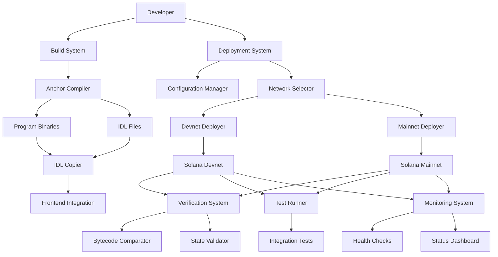
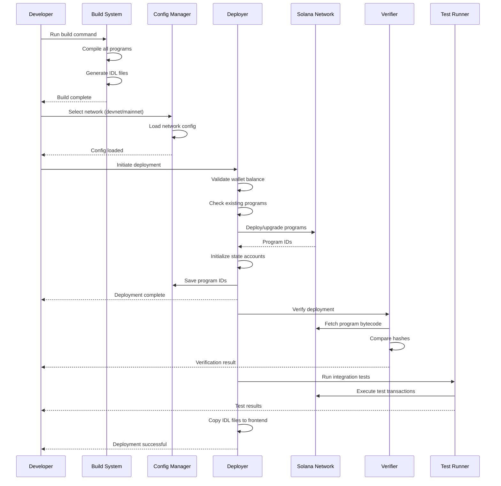

# Smart Contract Deployment - Design Document

## Overview

The Smart Contract Deployment system provides automated tooling for building, deploying, verifying, and managing the four AgentMarket Anchor programs across multiple Solana networks. The system emphasizes safety, verification, and ease of use while supporting the complete deployment lifecycle from development to production.

The deployment system consists of:
- Build scripts for compiling Anchor programs
- Deployment scripts for each network environment
- Configuration management for program IDs and network settings
- Verification tools for ensuring deployment integrity
- Integration test runners for validating on-chain functionality
- Monitoring utilities for tracking program health

## Architecture

### System Components



### Deployment Flow



## Components and Interfaces

### 1. Build System

**Purpose:** Compile Anchor programs and generate IDL files

**Implementation:**
- Shell script: `programs/build.sh`
- Uses Anchor CLI for compilation
- Validates Cargo.toml dependencies
- Generates IDL files in JSON format

**Interface:**
```bash
# Build all programs
./programs/build.sh

# Build specific program
./programs/build.sh agent-registry

# Build with verbose output
./programs/build.sh --verbose
```

**Output:**
- Compiled `.so` files in `target/deploy/`
- IDL JSON files in `target/idl/`
- Build logs in `target/build.log`

### 2. Configuration Manager

**Purpose:** Manage network-specific configurations and program IDs

**Configuration Files:**

`programs/config/devnet.json`:
```json
{
  "network": "devnet",
  "rpcUrl": "https://api.devnet.solana.com",
  "wsUrl": "wss://api.devnet.solana.com",
  "programIds": {
    "agentRegistry": "...",
    "marketplaceEscrow": "...",
    "reputationSystem": "...",
    "royaltySplitter": "..."
  },
  "wallets": {
    "deployer": "~/.config/solana/id.json",
    "admin": "...",
    "treasury": "..."
  },
  "fees": {
    "platformFee": 10,
    "treasuryFee": 5
  }
}
```

`programs/config/mainnet.json`:
```json
{
  "network": "mainnet-beta",
  "rpcUrl": "https://api.mainnet-beta.solana.com",
  "wsUrl": "wss://api.mainnet-beta.solana.com",
  "programIds": {
    "agentRegistry": "...",
    "marketplaceEscrow": "...",
    "reputationSystem": "...",
    "royaltySplitter": "..."
  },
  "wallets": {
    "deployer": "~/.config/solana/mainnet-deployer.json",
    "admin": "...",
    "treasury": "..."
  },
  "fees": {
    "platformFee": 10,
    "treasuryFee": 5
  }
}
```

**TypeScript Interface:**
```typescript
interface DeploymentConfig {
  network: 'devnet' | 'testnet' | 'mainnet-beta';
  rpcUrl: string;
  wsUrl: string;
  programIds: {
    agentRegistry: string;
    marketplaceEscrow: string;
    reputationSystem: string;
    royaltySplitter: string;
  };
  wallets: {
    deployer: string;
    admin: string;
    treasury: string;
  };
  fees: {
    platformFee: number;
    treasuryFee: number;
  };
}
```

### 3. Deployment Scripts

**Purpose:** Deploy and upgrade programs on Solana networks

**Devnet Deployment Script:** `programs/deploy-devnet.sh`

```bash
#!/bin/bash
# Deploy all programs to devnet

set -e

echo "🚀 Deploying to Devnet..."

# Load configuration
CONFIG_FILE="programs/config/devnet.json"
DEPLOYER_WALLET=$(jq -r '.wallets.deployer' $CONFIG_FILE)

# Set Solana CLI to devnet
solana config set --url devnet

# Check wallet balance
BALANCE=$(solana balance $DEPLOYER_WALLET | awk '{print $1}')
echo "Deployer balance: $BALANCE SOL"

if (( $(echo "$BALANCE < 10" | bc -l) )); then
    echo "❌ Insufficient balance. Need at least 10 SOL for deployment."
    exit 1
fi

# Deploy each program
echo "📦 Deploying agent_registry..."
anchor deploy --program-name agent_registry --provider.cluster devnet

echo "📦 Deploying marketplace_escrow..."
anchor deploy --program-name marketplace_escrow --provider.cluster devnet

echo "📦 Deploying reputation_system..."
anchor deploy --program-name reputation_system --provider.cluster devnet

echo "📦 Deploying royalty_splitter..."
anchor deploy --program-name royalty_splitter --provider.cluster devnet

# Save program IDs
echo "💾 Saving program IDs..."
./programs/scripts/save-program-ids.sh devnet

# Initialize programs
echo "🔧 Initializing program state..."
./programs/scripts/initialize-programs.sh devnet

# Verify deployment
echo "✅ Verifying deployment..."
./programs/scripts/verify-deployment.sh devnet

# Copy IDL files
echo "📋 Copying IDL files to frontend..."
./programs/scripts/copy-idls.sh

echo "✅ Devnet deployment complete!"
```

**Mainnet Deployment Script:** `programs/deploy-mainnet.sh`

```bash
#!/bin/bash
# Deploy all programs to mainnet with safety checks

set -e

echo "🚨 MAINNET DEPLOYMENT 🚨"
echo "This will deploy to production. Are you sure?"
read -p "Type 'DEPLOY TO MAINNET' to continue: " confirmation

if [ "$confirmation" != "DEPLOY TO MAINNET" ]; then
    echo "❌ Deployment cancelled"
    exit 1
fi

# Load configuration
CONFIG_FILE="programs/config/mainnet.json"
DEPLOYER_WALLET=$(jq -r '.wallets.deployer' $CONFIG_FILE)

# Set Solana CLI to mainnet
solana config set --url mainnet-beta

# Check wallet balance
BALANCE=$(solana balance $DEPLOYER_WALLET | awk '{print $1}')
echo "Deployer balance: $BALANCE SOL"

if (( $(echo "$BALANCE < 50" | bc -l) )); then
    echo "❌ Insufficient balance. Need at least 50 SOL for mainnet deployment."
    exit 1
fi

# Verify devnet testing complete
if [ ! -f "programs/.devnet-verified" ]; then
    echo "❌ Devnet testing not verified. Deploy and test on devnet first."
    exit 1
fi

# Dry run
echo "🧪 Running deployment dry-run..."
anchor deploy --program-name agent_registry --provider.cluster mainnet-beta --dry-run

# Deploy each program
echo "📦 Deploying agent_registry..."
anchor deploy --program-name agent_registry --provider.cluster mainnet-beta

echo "📦 Deploying marketplace_escrow..."
anchor deploy --program-name marketplace_escrow --provider.cluster mainnet-beta

echo "📦 Deploying reputation_system..."
anchor deploy --program-name reputation_system --provider.cluster mainnet-beta

echo "📦 Deploying royalty_splitter..."
anchor deploy --program-name royalty_splitter --provider.cluster mainnet-beta

# Save program IDs
echo "💾 Saving program IDs..."
./programs/scripts/save-program-ids.sh mainnet

# Initialize programs
echo "🔧 Initializing program state..."
./programs/scripts/initialize-programs.sh mainnet

# Verify deployment
echo "✅ Verifying deployment..."
./programs/scripts/verify-deployment.sh mainnet

# Copy IDL files
echo "📋 Copying IDL files to frontend..."
./programs/scripts/copy-idls.sh

# Generate deployment report
echo "📄 Generating deployment report..."
./programs/scripts/generate-report.sh mainnet

echo "✅ Mainnet deployment complete!"
echo "📧 Sending notification..."
./programs/scripts/notify-deployment.sh mainnet
```

### 4. Program Initialization

**Purpose:** Initialize state accounts and configuration after deployment

**Script:** `programs/scripts/initialize-programs.sh`

```typescript
import * as anchor from '@coral-xyz/anchor';
import { Program } from '@coral-xyz/anchor';
import { PublicKey, Keypair } from '@solana/web3.js';
import fs from 'fs';

interface Config {
  network: string;
  rpcUrl: string;
  programIds: {
    agentRegistry: string;
    marketplaceEscrow: string;
    reputationSystem: string;
    royaltySplitter: string;
  };
  wallets: {
    deployer: string;
    admin: string;
    treasury: string;
  };
  fees: {
    platformFee: number;
    treasuryFee: number;
  };
}

async function initializePrograms(network: string) {
  // Load configuration
  const config: Config = JSON.parse(
    fs.readFileSync(`programs/config/${network}.json`, 'utf-8')
  );

  // Setup connection
  const connection = new anchor.web3.Connection(config.rpcUrl, 'confirmed');
  const deployerKeypair = Keypair.fromSecretKey(
    Uint8Array.from(JSON.parse(fs.readFileSync(config.wallets.deployer, 'utf-8')))
  );
  const wallet = new anchor.Wallet(deployerKeypair);
  const provider = new anchor.AnchorProvider(connection, wallet, {
    commitment: 'confirmed',
  });

  console.log('🔧 Initializing Agent Registry...');
  await initializeAgentRegistry(provider, config);

  console.log('🔧 Initializing Marketplace Escrow...');
  await initializeMarketplaceEscrow(provider, config);

  console.log('🔧 Initializing Reputation System...');
  await initializeReputationSystem(provider, config);

  console.log('🔧 Initializing Royalty Splitter...');
  await initializeRoyaltySplitter(provider, config);

  console.log('✅ All programs initialized successfully');
}

async function initializeAgentRegistry(
  provider: anchor.AnchorProvider,
  config: Config
) {
  const programId = new PublicKey(config.programIds.agentRegistry);
  const idl = JSON.parse(
    fs.readFileSync('target/idl/agent_registry.json', 'utf-8')
  );
  const program = new Program(idl, programId, provider);

  // Derive platform config PDA
  const [platformConfig] = PublicKey.findProgramAddressSync(
    [Buffer.from('platform_config')],
    programId
  );

  try {
    // Check if already initialized
    await program.account.platformConfig.fetch(platformConfig);
    console.log('  ℹ️  Platform config already initialized');
  } catch {
    // Initialize platform config
    await program.methods
      .initializePlatform(
        new PublicKey(config.wallets.admin),
        new PublicKey(config.wallets.treasury)
      )
      .accounts({
        platformConfig,
        authority: provider.wallet.publicKey,
        systemProgram: anchor.web3.SystemProgram.programId,
      })
      .rpc();
    console.log('  ✅ Platform config initialized');
  }
}

async function initializeMarketplaceEscrow(
  provider: anchor.AnchorProvider,
  config: Config
) {
  const programId = new PublicKey(config.programIds.marketplaceEscrow);
  const idl = JSON.parse(
    fs.readFileSync('target/idl/marketplace_escrow.json', 'utf-8')
  );
  const program = new Program(idl, programId, provider);

  // Derive escrow config PDA
  const [escrowConfig] = PublicKey.findProgramAddressSync(
    [Buffer.from('escrow_config')],
    programId
  );

  try {
    await program.account.escrowConfig.fetch(escrowConfig);
    console.log('  ℹ️  Escrow config already initialized');
  } catch {
    await program.methods
      .initializeEscrow(
        config.fees.platformFee,
        config.fees.treasuryFee,
        new PublicKey(config.wallets.treasury)
      )
      .accounts({
        escrowConfig,
        authority: provider.wallet.publicKey,
        systemProgram: anchor.web3.SystemProgram.programId,
      })
      .rpc();
    console.log('  ✅ Escrow config initialized');
  }
}

async function initializeReputationSystem(
  provider: anchor.AnchorProvider,
  config: Config
) {
  const programId = new PublicKey(config.programIds.reputationSystem);
  const idl = JSON.parse(
    fs.readFileSync('target/idl/reputation_system.json', 'utf-8')
  );
  const program = new Program(idl, programId, provider);

  // Derive reputation config PDA
  const [reputationConfig] = PublicKey.findProgramAddressSync(
    [Buffer.from('reputation_config')],
    programId
  );

  try {
    await program.account.reputationConfig.fetch(reputationConfig);
    console.log('  ℹ️  Reputation config already initialized');
  } catch {
    await program.methods
      .initializeReputation()
      .accounts({
        reputationConfig,
        authority: provider.wallet.publicKey,
        systemProgram: anchor.web3.SystemProgram.programId,
      })
      .rpc();
    console.log('  ✅ Reputation config initialized');
  }
}

async function initializeRoyaltySplitter(
  provider: anchor.AnchorProvider,
  config: Config
) {
  const programId = new PublicKey(config.programIds.royaltySplitter);
  const idl = JSON.parse(
    fs.readFileSync('target/idl/royalty_splitter.json', 'utf-8')
  );
  const program = new Program(idl, programId, provider);

  // Derive royalty config PDA
  const [royaltyConfig] = PublicKey.findProgramAddressSync(
    [Buffer.from('royalty_config')],
    programId
  );

  try {
    await program.account.royaltyConfig.fetch(royaltyConfig);
    console.log('  ℹ️  Royalty config already initialized');
  } catch {
    await program.methods
      .initializeRoyalty(
        85, // Creator share
        10, // Platform share
        5   // Treasury share
      )
      .accounts({
        royaltyConfig,
        authority: provider.wallet.publicKey,
        systemProgram: anchor.web3.SystemProgram.programId,
      })
      .rpc();
    console.log('  ✅ Royalty config initialized');
  }
}

// Run initialization
const network = process.argv[2] || 'devnet';
initializePrograms(network).catch(console.error);
```

### 5. Verification System

**Purpose:** Verify deployed programs match source code

**Script:** `programs/scripts/verify-deployment.sh`

```bash
#!/bin/bash
# Verify deployed programs match built binaries

set -e

NETWORK=$1
CONFIG_FILE="programs/config/${NETWORK}.json"

echo "🔍 Verifying deployment on ${NETWORK}..."

# Function to verify a single program
verify_program() {
    local PROGRAM_NAME=$1
    local PROGRAM_ID=$(jq -r ".programIds.${PROGRAM_NAME}" $CONFIG_FILE)
    
    echo "Verifying ${PROGRAM_NAME} (${PROGRAM_ID})..."
    
    # Get deployed program data
    solana program dump $PROGRAM_ID deployed_${PROGRAM_NAME}.so
    
    # Compare with built binary
    LOCAL_HASH=$(sha256sum target/deploy/${PROGRAM_NAME}.so | awk '{print $1}')
    DEPLOYED_HASH=$(sha256sum deployed_${PROGRAM_NAME}.so | awk '{print $1}')
    
    if [ "$LOCAL_HASH" == "$DEPLOYED_HASH" ]; then
        echo "  ✅ ${PROGRAM_NAME} verified"
        rm deployed_${PROGRAM_NAME}.so
        return 0
    else
        echo "  ❌ ${PROGRAM_NAME} verification failed"
        echo "  Local hash:    $LOCAL_HASH"
        echo "  Deployed hash: $DEPLOYED_HASH"
        rm deployed_${PROGRAM_NAME}.so
        return 1
    fi
}

# Verify all programs
FAILED=0

verify_program "agent_registry" || FAILED=1
verify_program "marketplace_escrow" || FAILED=1
verify_program "reputation_system" || FAILED=1
verify_program "royalty_splitter" || FAILED=1

if [ $FAILED -eq 0 ]; then
    echo "✅ All programs verified successfully"
    touch "programs/.${NETWORK}-verified"
    exit 0
else
    echo "❌ Verification failed"
    exit 1
fi
```

### 6. IDL Management

**Purpose:** Copy IDL files to frontend and update program IDs

**Script:** `programs/scripts/copy-idls.sh`

```bash
#!/bin/bash
# Copy IDL files to frontend

set -e

NETWORK=${1:-devnet}
CONFIG_FILE="programs/config/${NETWORK}.json"
TARGET_DIR="src/lib/idl"

echo "📋 Copying IDL files to frontend..."

# Create target directory if it doesn't exist
mkdir -p $TARGET_DIR

# Function to copy and update IDL
copy_idl() {
    local PROGRAM_NAME=$1
    local IDL_FILE="target/idl/${PROGRAM_NAME}.json"
    local TARGET_FILE="${TARGET_DIR}/${PROGRAM_NAME}.json"
    local PROGRAM_ID=$(jq -r ".programIds.${PROGRAM_NAME}" $CONFIG_FILE)
    
    echo "Copying ${PROGRAM_NAME}.json..."
    
    # Copy IDL and update program ID
    jq --arg id "$PROGRAM_ID" '.metadata.address = $id' $IDL_FILE > $TARGET_FILE
    
    echo "  ✅ Copied with program ID: $PROGRAM_ID"
}

# Backup existing IDLs
if [ -d "$TARGET_DIR" ]; then
    BACKUP_DIR="${TARGET_DIR}_backup_$(date +%Y%m%d_%H%M%S)"
    echo "📦 Backing up existing IDLs to ${BACKUP_DIR}"
    cp -r $TARGET_DIR $BACKUP_DIR
fi

# Copy all IDLs
copy_idl "agent_registry"
copy_idl "marketplace_escrow"
copy_idl "reputation_system"
copy_idl "royalty_splitter"

echo "✅ IDL files copied successfully"
```

## Data Models

### Deployment Metadata

```typescript
interface DeploymentMetadata {
  network: 'devnet' | 'testnet' | 'mainnet-beta';
  timestamp: number;
  deployer: string;
  programs: {
    agentRegistry: ProgramDeployment;
    marketplaceEscrow: ProgramDeployment;
    reputationSystem: ProgramDeployment;
    royaltySplitter: ProgramDeployment;
  };
  verification: {
    verified: boolean;
    verifiedAt?: number;
    hashes: Record<string, string>;
  };
  initialization: {
    initialized: boolean;
    initializedAt?: number;
    configAccounts: Record<string, string>;
  };
}

interface ProgramDeployment {
  programId: string;
  deploymentSlot: number;
  transactionSignature: string;
  upgradeAuthority: string;
  dataLength: number;
  rentExemptBalance: number;
}
```

### Verification Report

```typescript
interface VerificationReport {
  network: string;
  timestamp: number;
  programs: {
    name: string;
    programId: string;
    localHash: string;
    deployedHash: string;
    verified: boolean;
  }[];
  overallStatus: 'verified' | 'failed';
}
```


## Correctness Properties

*A property is a characteristic or behavior that should hold true across all valid executions of a system-essentially, a formal statement about what the system should do. Properties serve as the bridge between human-readable specifications and machine-verifiable correctness guarantees.*

### Property 1: IDL Generation Completeness

*For any* Anchor program that compiles successfully, the build system should generate a corresponding IDL file in valid JSON format.

**Validates: Requirements 1.2**

### Property 2: Dependency Validation

*For any* Cargo.toml file in the programs directory, the build system should validate that all dependencies are correctly specified with valid versions and features.

**Validates: Requirements 1.4**

### Property 3: Network Configuration Loading

*For any* network environment (devnet, testnet, mainnet), the deployment system should load the correct configuration file with appropriate program IDs and RPC endpoints.

**Validates: Requirements 1.5, 10.2**

### Property 4: Post-Deployment Verification

*For any* program deployment, the system should be able to fetch the deployed program account from the blockchain, confirming successful deployment.

**Validates: Requirements 2.2**

### Property 5: Wallet Balance Validation

*For any* wallet used for deployment, the system should validate that the balance exceeds the minimum required threshold before attempting deployment operations.

**Validates: Requirements 2.4, 9.